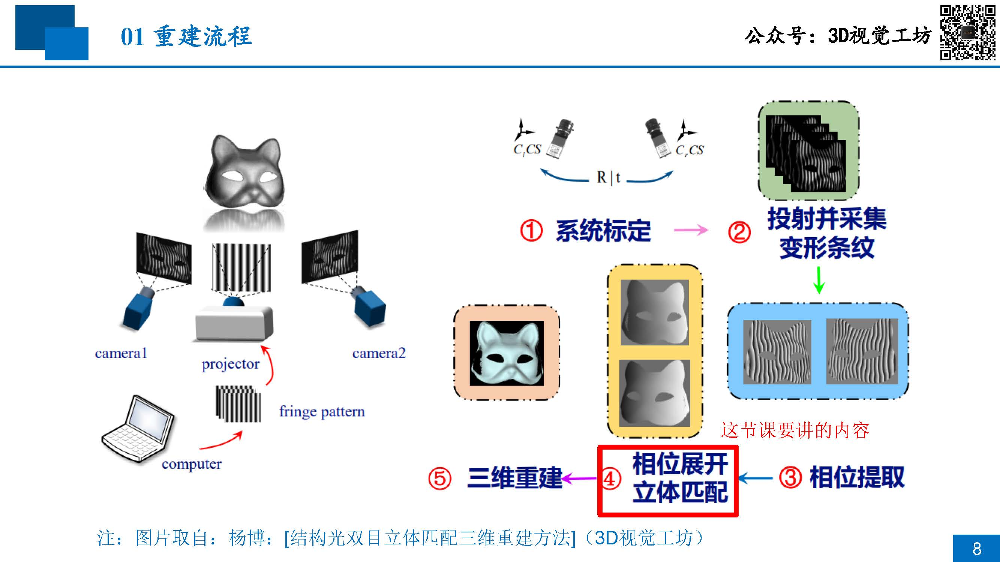
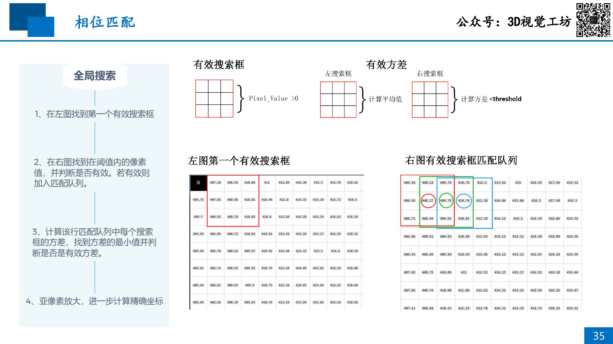
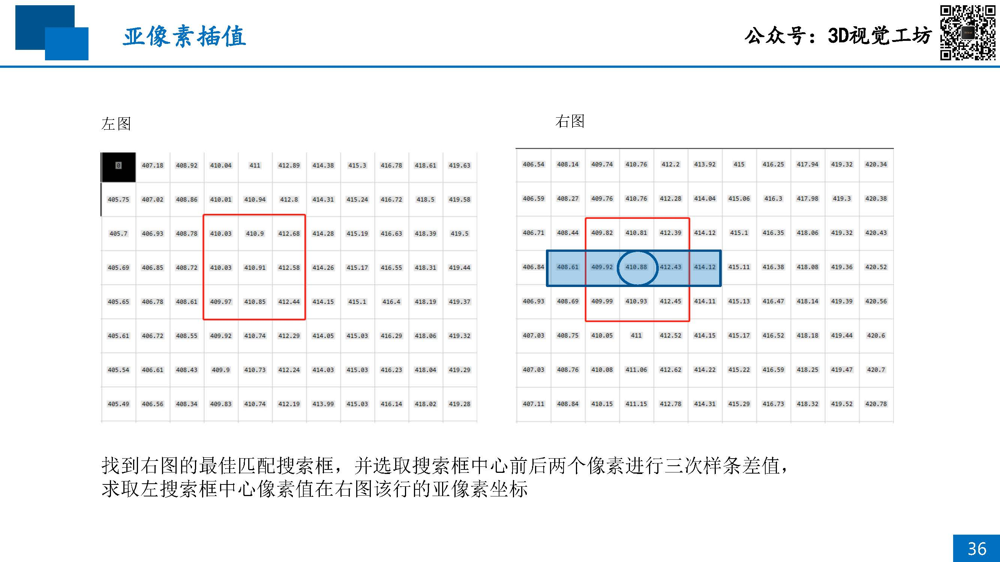

# 07 双目重建实践：三角法

## 目录
- [重建流程](#重建流程)
- [匹配方法](#匹配方法)

## 重建流程

1. 标定
    1. 相机参数
        - 内参
        - 外参
    1. 畸变系数
        - 径向畸变
        - 切向畸变
1. 双目模型的建立
    - 校正前：非理想双目模型
    - 校正后：理想双目模型
    - 和LLM聊了一下，使用对极几何的方式和校正后使用理想双目模型的方式应当精度差不多
1. 相位提取
    1. 生成条纹
    1. 解相位
        - 时域
            1. 多频外差
                - 两个周期的相位差，合成一个更长周期的相位
            1. 格雷码
                - 相较于多频外差法，投影的图片数量少
        - 空域
1. 滤波

## 匹配方法

1. 构建双目模型
1. 极线校正
1. 相位匹配
    

    

[08-Practice-of-Monocular-Reconstruction-1](./08-Practice-of-Monocular-Reconstruction-1.md)