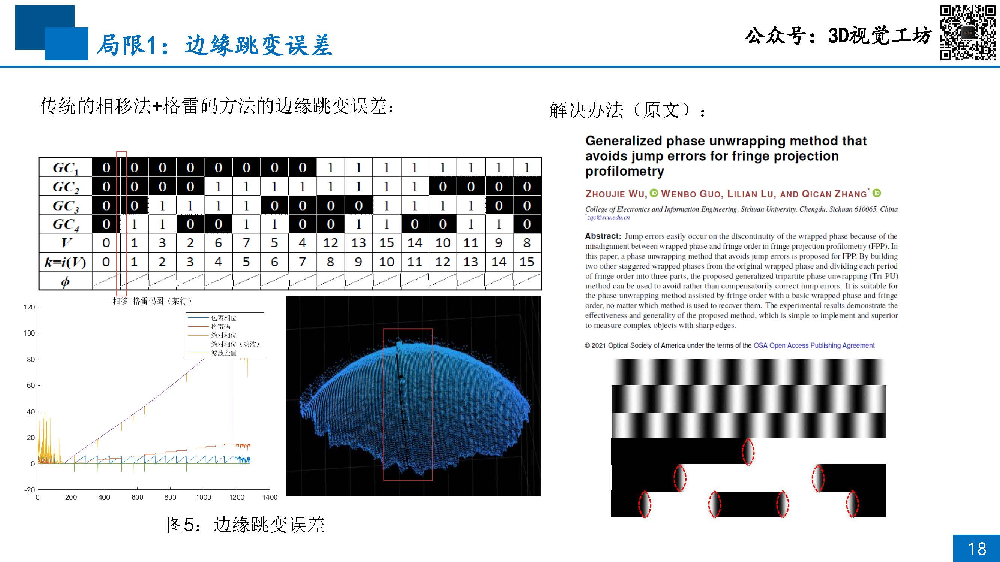

# 08 单目重建实践：逆相机法

## 目录
- [单目成像模型](#单目成像模型)
- [重建原理](#重建原理)
- [投影仪标定](#投影仪标定)
- [局限性](#局限性)

## 单目成像模型

## 重建原理

- 由一台相机和一个投影仪配合实现

## 投影仪标定

- 相机标定相对容易，那么投影仪标定该如何去做？

## 局限性

[09-Practice-of-Monocular-Reconstruction-2](./09-Practice-of-Monocular-Reconstruction-2.md)