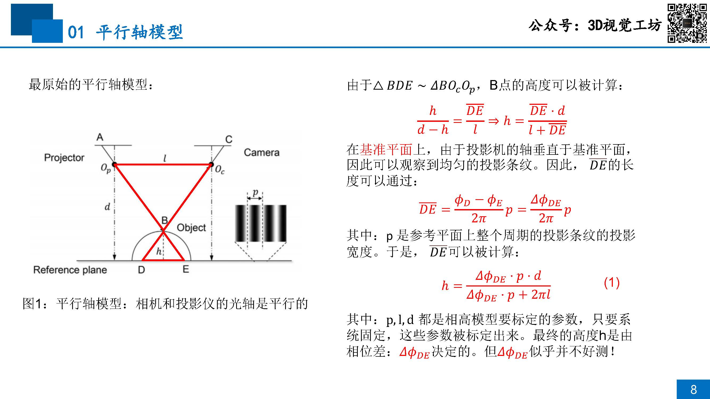
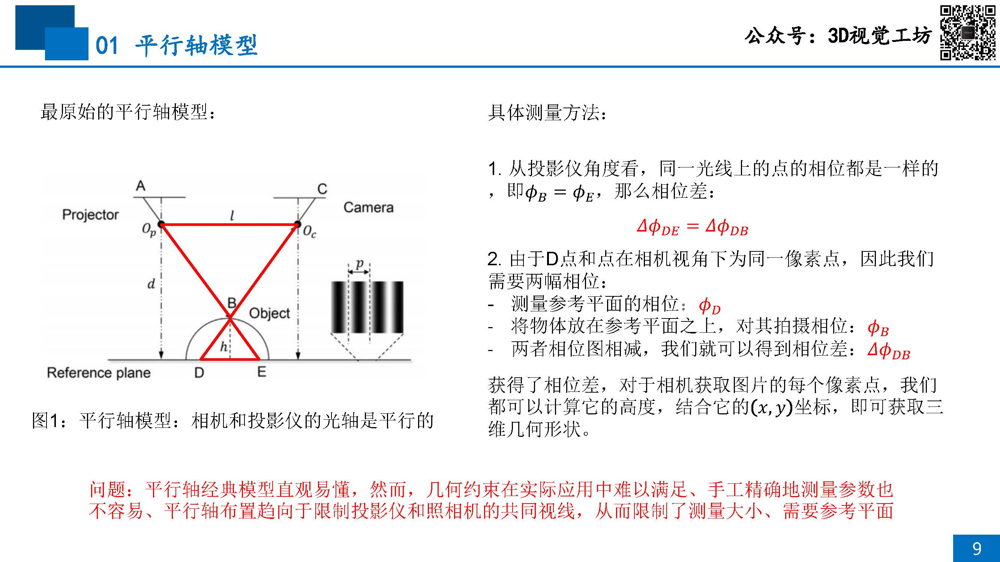
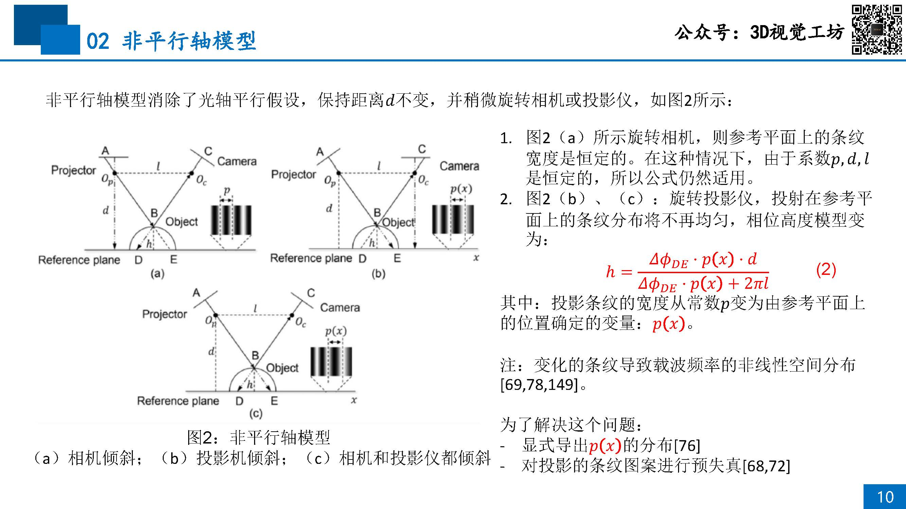
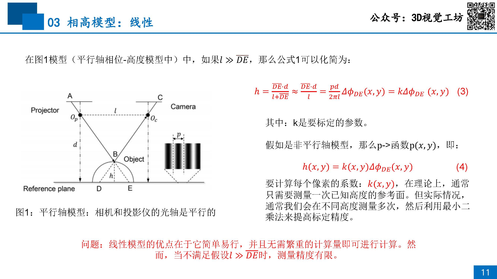
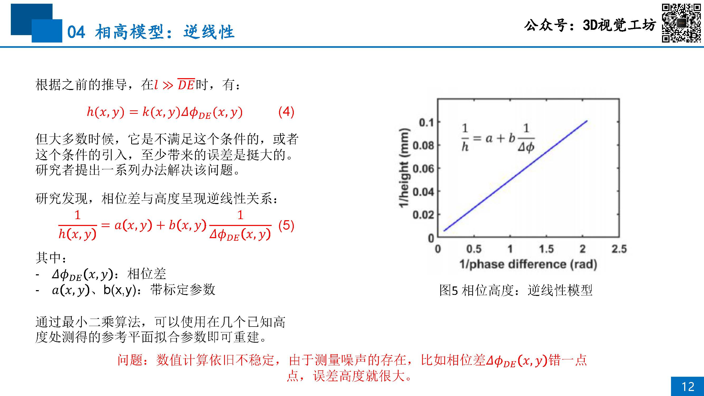
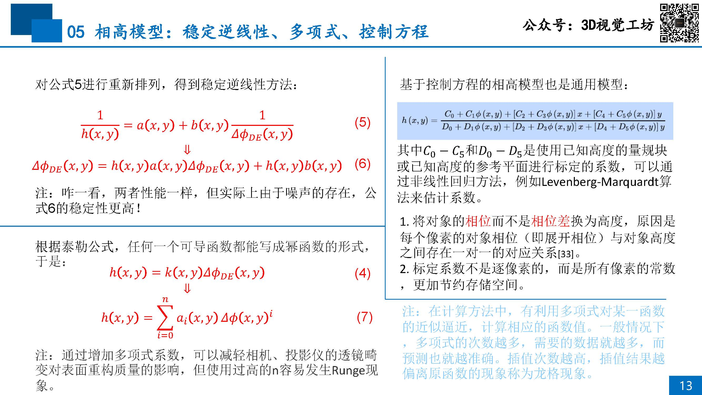

# 09 单目重建实践：相高法

## 目录
- [平行轴模型](#平行轴模型)
- [非平行轴模型](#非平行轴模型)
- [相高模型：线性](#相高模型线性)
- [相高模型：逆线性](#相高模型逆线性)
- [相高模型：稳定逆线性、多项式、控制方程](#相高模型稳定逆线性多项式控制方程)

## 平行轴模型

## 非平行轴模型

## 相高模型：线性

## 相高模型：逆线性

## 相高模型：稳定逆线性、多项式、控制方程

[10-Nonlinear-Correction-of-Pojectors](./10-Nonlinear-Correction-of-Pojectors.md)