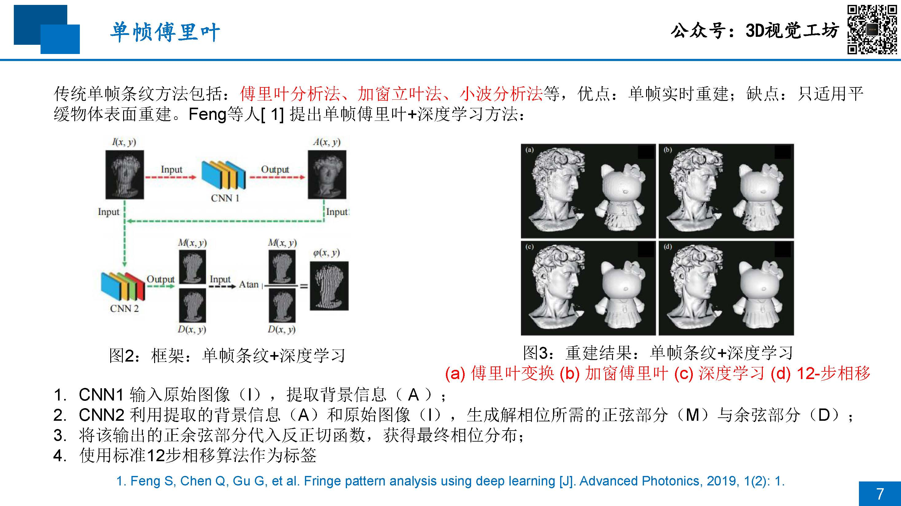
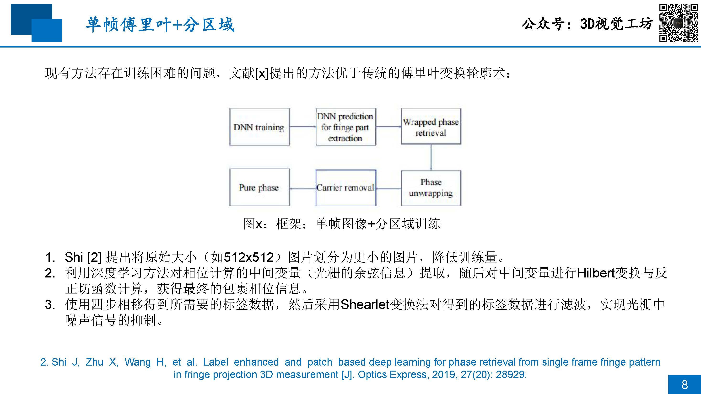
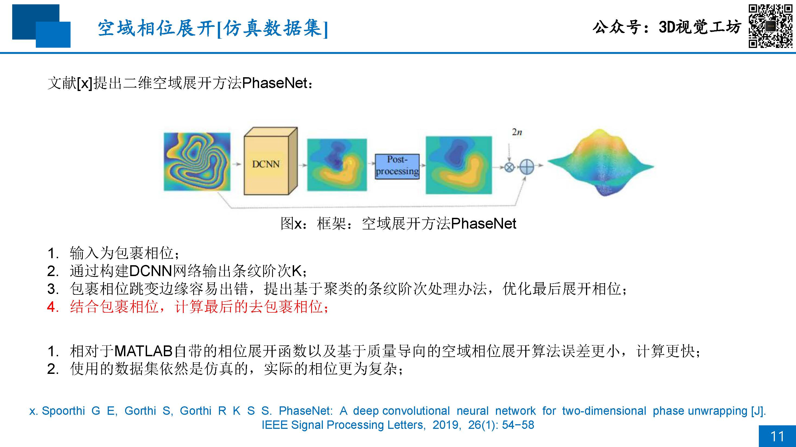
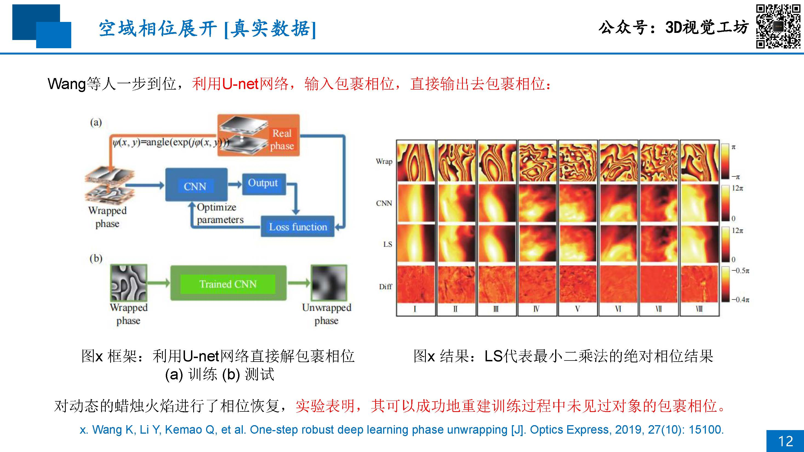
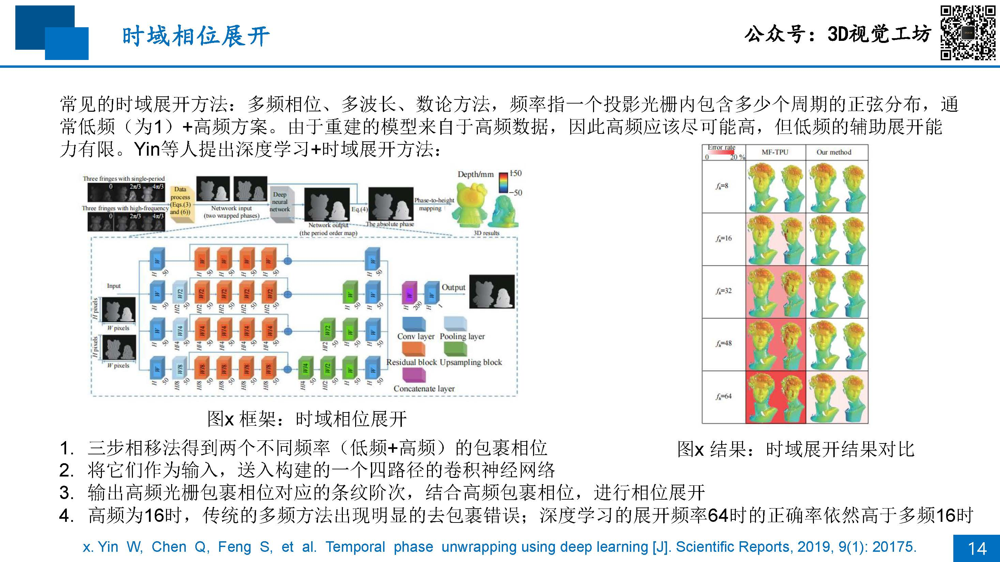
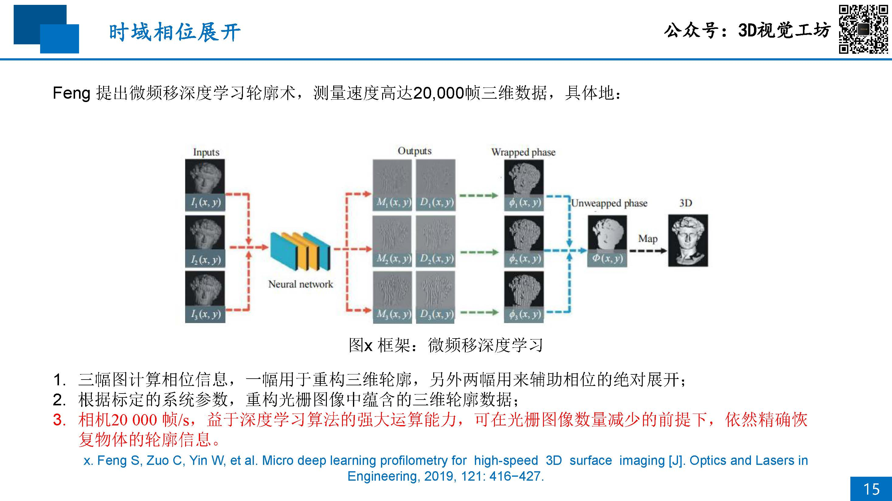
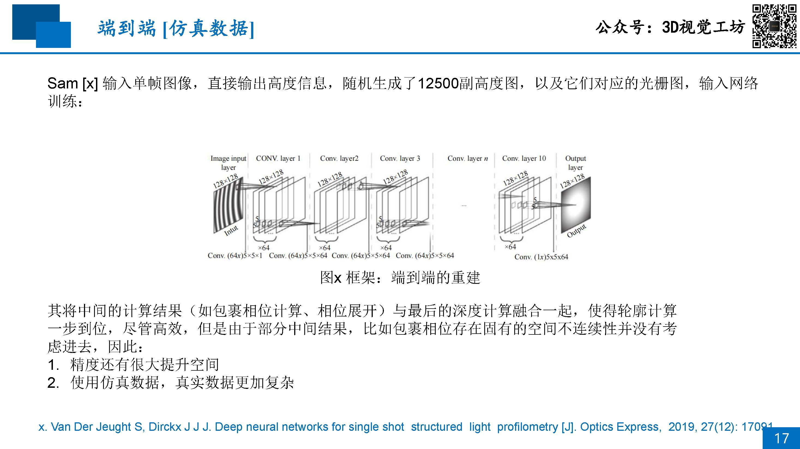
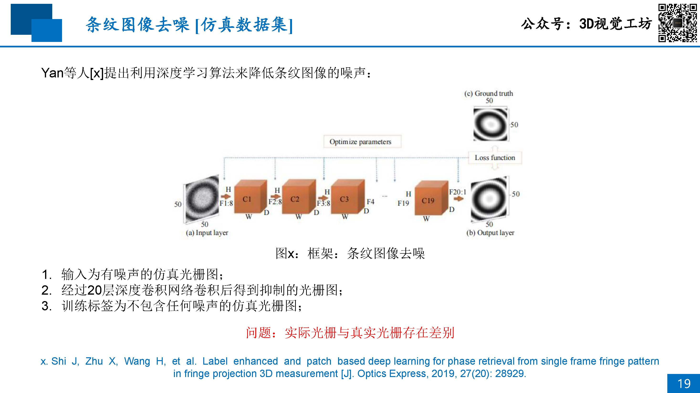
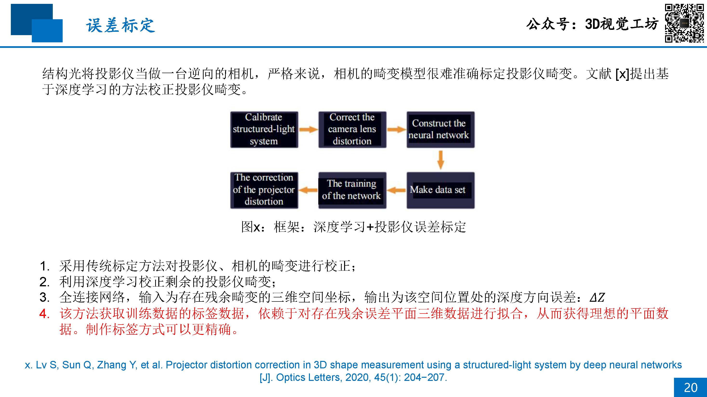

# 11 结构光+深度学习

## 目录
- [单帧条纹（空域相位解调）](#单帧条纹空域相位解调)
- [多帧条纹](#多帧条纹)
    - [空域展开](#空域展开)
    - [时域展开](#时域展开)
- [端到端](#端到端)
- [误差补偿](#误差补偿)

## 单帧条纹（空域相位解调）

## 多帧条纹

### 空域展开

### 时域展开

## 端到端

## 误差补偿

[OpenClass1](./OpenClass1.md)