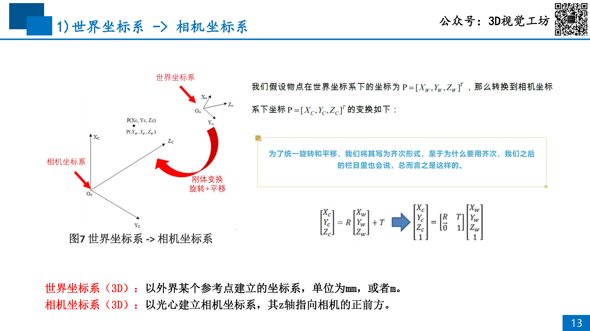
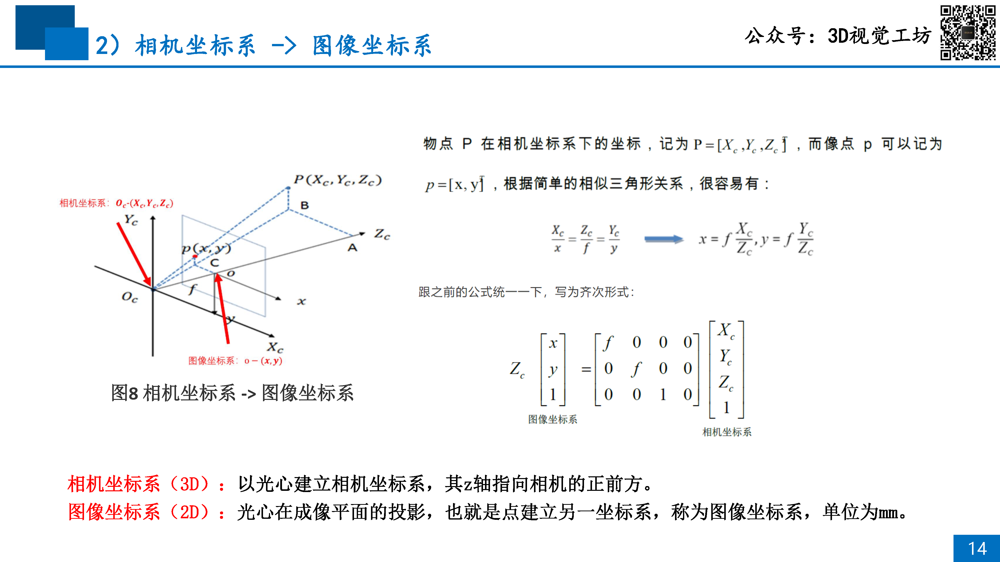
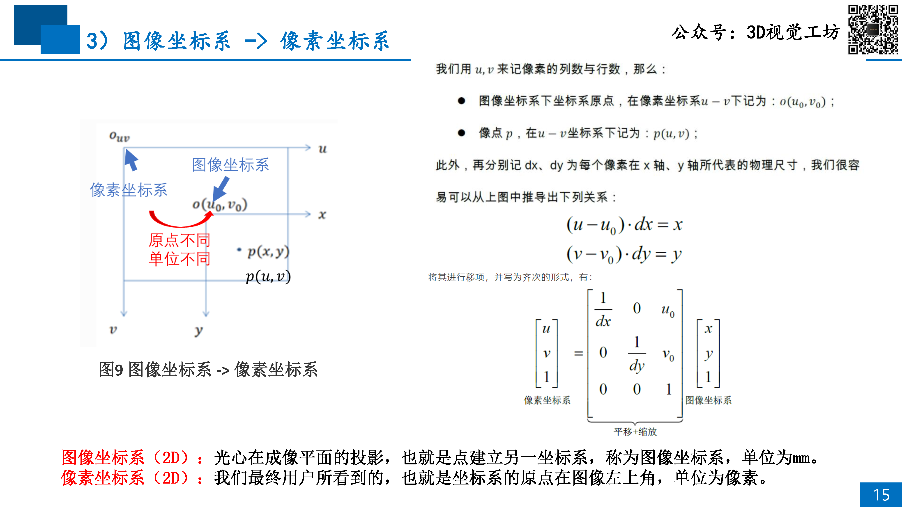
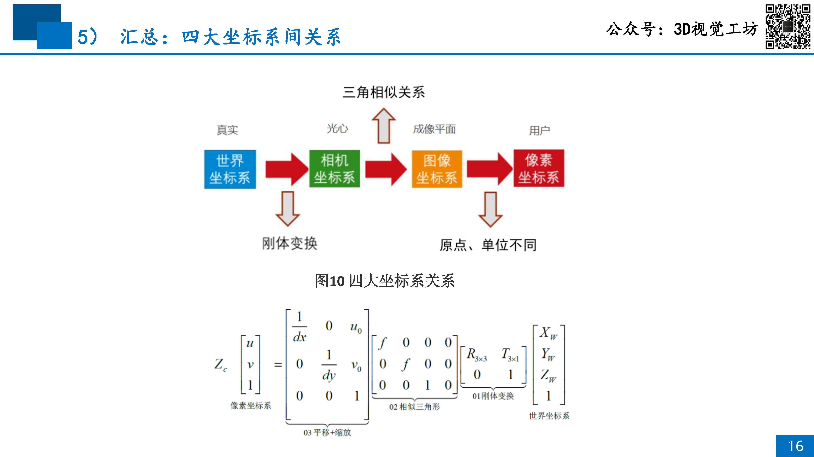
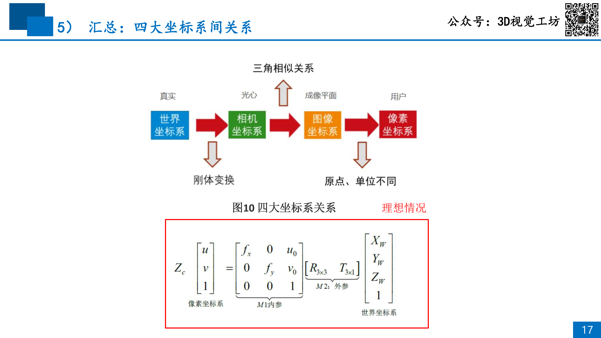

# 02 单目标定理论+实践：计算内参，去除畸变

## 目录
- [1 引入双目视觉的原因](#1-引入双目视觉的原因)
- [2 理想双目测距模型](#2-理想双目测距模型)
- [3 实际双目测距模型](#3-实际双目测距模型)
- [4 双目视觉的优缺点](#4-双目视觉的优缺点)
- [5 加入结构光需要解决的问题](#5-加入结构光需要解决的问题)

## 1 标定的意义
- 任何传感器都是存在有误差的。狭义上说，标定就是去校正这部分误差，让传感器尽量准确一点

1. 单目标定的意义：
    - 确定相机内参
    - 纠正相机误差
1. 双目标定的意义：
    - 确定相机内参
    - 纠正相机误差
    - 确定两台相机的相对位置关系

- 厂家不做标定的原因：
    1. 相机的光圈和焦距可调
    1. 焦距直接影响相机的成像模型
    1. 光圈通过影响畸变等因素，简介的影响相机的成像模型

## 2 成像原理
1. 相机的成像原理是小孔模型
    - 当光圈越小，越符合小孔成像模型
    - 但是光圈太小，影响曝光，需要增大 ISO 或曝光时间。因此光圈和成像效果需要得到平衡

1. 四大坐标系
    1. 世界坐标系
    1. 相机坐标系
    1. 图像坐标系
    1. 像素坐标系
    

1. 转换流程
    1. 世界 -> 相机
    

    1. 相机 -> 图像
    

    1. 图像 -> 像素
    

    1. 联立情况
    

    1. 理想情况
    