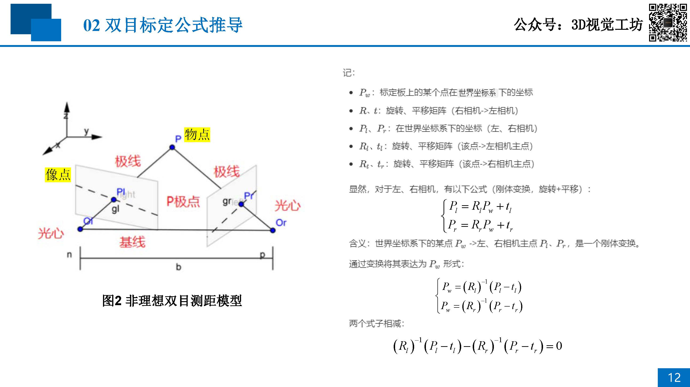
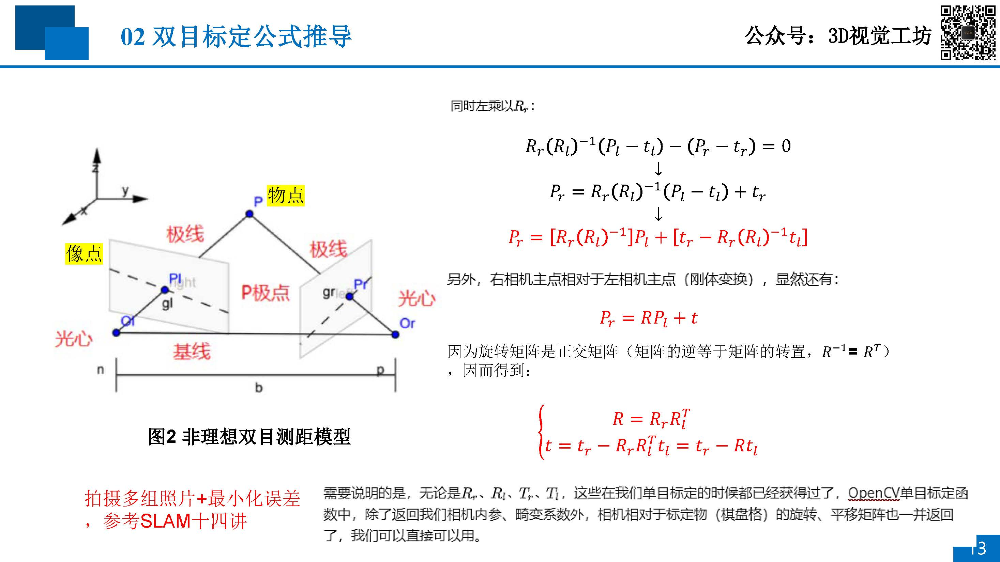

# 03 双目标定理论+实践：确定相机相互位置

## 目录
- [问题解答](#问题解答)
- [为什么需要进行双目标定](#为什么需要进行双目标定)
- [双目标定公式推导](#双目标定公式推导)

## 问题解答
1. 标定板质量很重要
    - 算法精度一定的情况下，标定精度越高，最终重建的效果越好
    - 标定对精度的影响更大
1. 合适的曝光（图片放大看角点，需要清晰）
    - 需要角点尽量的清晰
    - 用工业相机的UI调整参数，让角点尽可能的清洗
    - 透明的标定板需要背光板
    - 陶瓷标定板需要平行光源
1. 圆环标定会更准一点
    - 透明标定板需要从背面打光
    - 不透明标定板需要从正面打平行光源
    - opencv的圆环标定精确度一般，不如matlab的棋盘格标定准
1. 四宫格法标定，每个角不同角度放3个，大约27张
1. 适当剔除一些误差较大的图片
1. 标定很重要，很多时候重建算法精度低，主要原因在于标定的质量不高
1. 多标定几次，总有一次是好的

## 为什么需要进行双目标定
1. 假设
    - 单目相机标定后，内外参数均具备了；但是双目相机还需要相机的光轴平行，且像点在左右图像上的高度一致
    1. 单目标定：两部相机是绝对理想的，不存在任何畸变，且相机参数一致；
    1. 双目标定：确定位置，进行校正，左右相机位于同一平面，且光轴平行；
1. 优点
    - 后续的立体匹配时，只需在同一行上搜索左右像平面的匹配点即可，能使效率大大提高

## 双目标定公式推导

**学习Bouguet** 极线校正的内容

[04-Binocular-Stereo-Matching-Algorithm](./04-Binocular-Stereo-Matching-Algorithm.md)