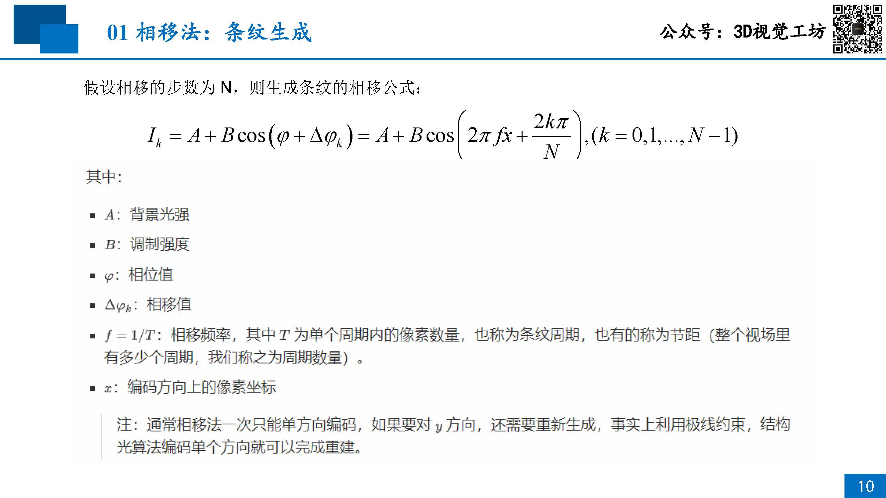
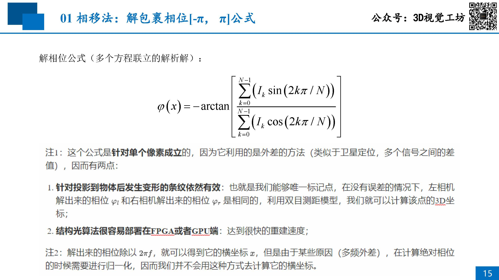
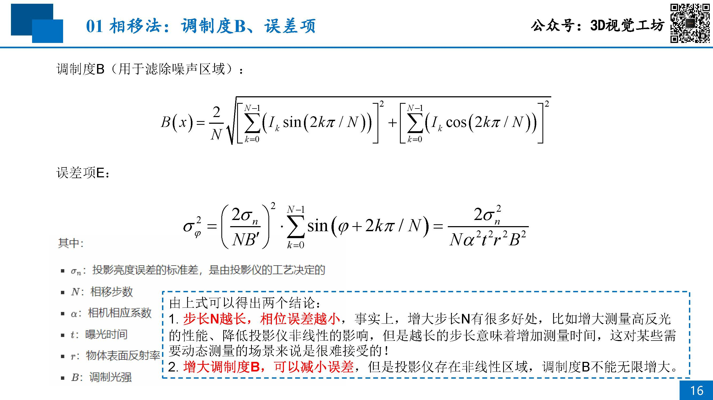
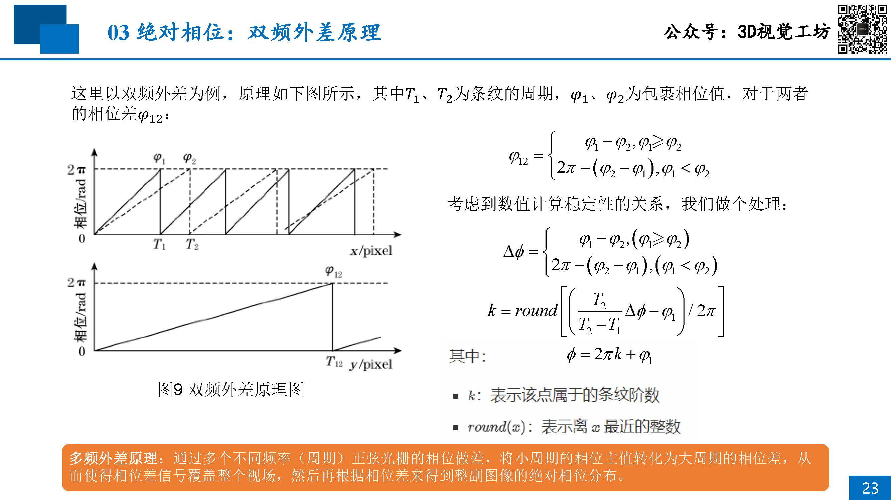
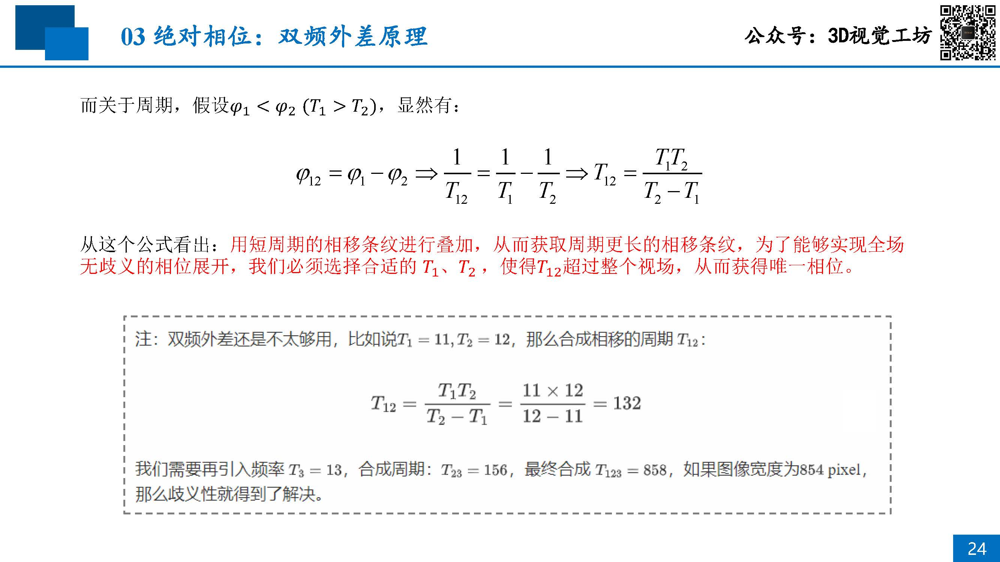
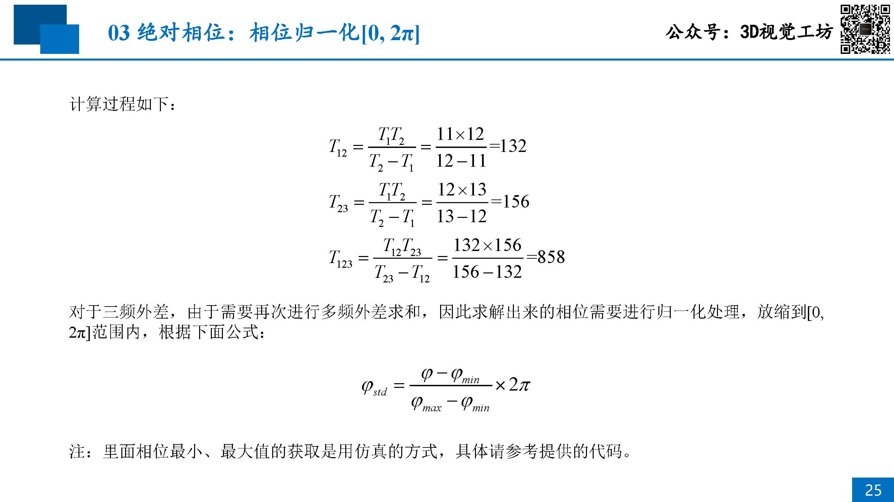

# 05 主动标记区域：相移法+多频外差

## 目录
- [相移法：解包裹相位](#相移法解包裹相位)
- [相移法 + 双频外差法：解绝对相位](#相移法--双频外差法解绝对相位)


## 相移法：解包裹相位
比较```计算机生成的理想条纹```和```相机拍摄的实际发生形变条纹```

- 编码相位
    

- 解码相位
    

- 调制度
    


## 相移法 + 双频外差法：解绝对相位
    

    

    


[06-Active-Marking-Area-2](./06-Active-Marking-Area-2.md)