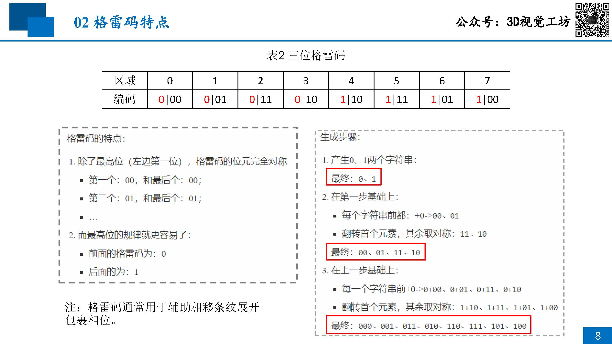
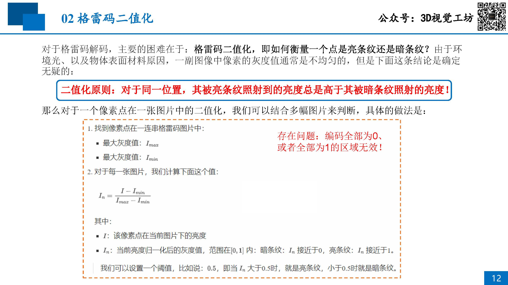
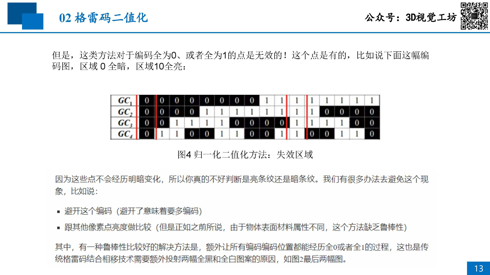
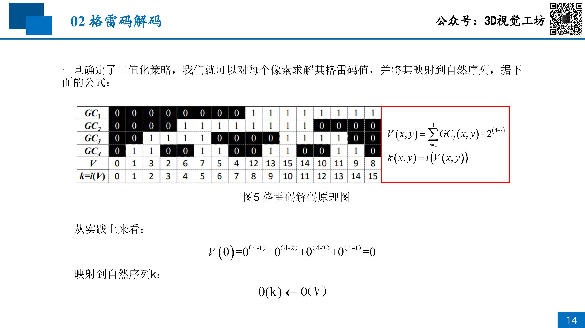

# 06 主动标记区域：相移法+格雷码

## 目录
- [格雷码](#格雷码)

## 格雷码

标记的方法有很多，为什么要用格雷码？
- 相移法+多频外差，如果采用12步相移+单频相移，就需要36幅图片，静态测量还能够接受；如果是动态测量，这个速度就不够了

格雷码存在的问题：
- 在相机拍照清晰的情况下不会有任何问题。但是，如果投影的黑白分界线恰巧在一个像素点上，该把这个像素点分类为黑色还是白色将是一个很大的问题。

格雷码的特点：
    

格雷码投影图案的处理：
    

    

格雷码的解码：
    

**只有确定二值化阈值范围的时候，才需要纯黑、纯白的两幅图片**

**需要做滤波，不然生成的相位图，会很割裂，边缘跳变的误差不会被消除掉**

[07-Practice-of-Binocular-Reconstruction](./07-Practice-of-Binocular-Reconstruction.md)